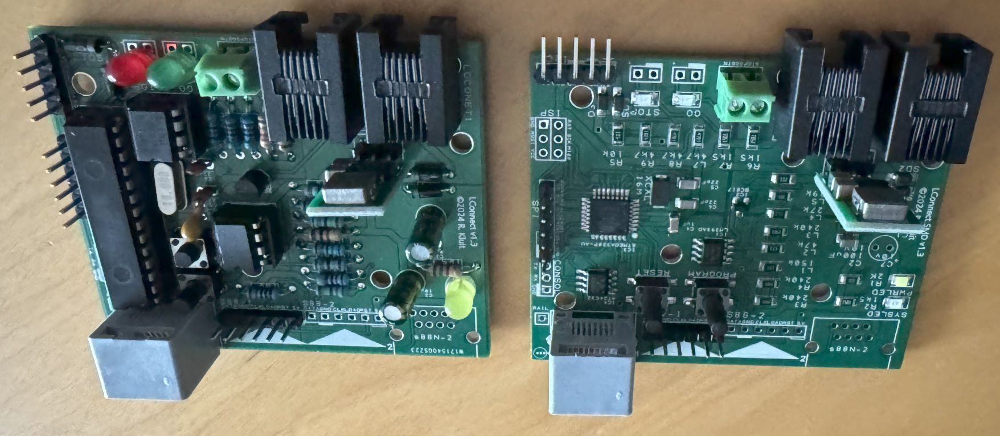

# LocoConnect
LocoConnect controller board Firmware

## Description:

The LConnect is a low cost efficient Loconet feedback and accessories decoder for model railroad. It is created to allow extensive but affordable interaction between the loconet bus and model railroad equipment.
It has far more features than most commercial of the shelve devices. However, due to the limits of the relatively cheap ATmega328p cpu, the possibilities are not endless.
The controller has the following features:

## Installation:
### Option A: Compilation and upload using Serial

- Install Arduino IDE 2.0 or later
- install the required depandancies
- Download the source code
- Compile and upload

### Option B: Firmware upload using SD card

**Requires the LocoConnect bootloader to be installed:** https://github.com/LocoConnect/LCBootloader/releases<br />
- Install Arduino IDE 2.0 or later
- install the required depandancies
- Download the source code
- Compile
- Convert Hex output file to binary file:<br />
```shell
%localappdata%\arduino15\packages\arduino\tools\avr-gcc\7.3.0-atmel3.6.1-arduino7\avr\bin\objcopy.exe -I ihex -O binary LocoConnect.ino.hex LCONNECT.BIN
```
- Copy the LCONNECT.BIN file to the SD Card<br />
- Attach the SD Card to the SPI connector of the PCB
- Power on or reset the LocoConnect device.

## Features:

### Track occupation and feedback:

**Native S88/S88n interface**
- A primary S88 / s88n occupation bus for maximum of 16x8 contacts.
- The PCB has a second S88 connector for future usage.
- The S88 routine is timer interrupt based.

**I2C based occupation:**
-	The I2C connection supports 16 x 8 feedback modules based on the PCF8574 chip.
-	The I2C feedback contacts will report as active if the I2C attached device is disconnected.
-	The I2C addressing starts with 56 (0x38) and the last maximum addressable feedback module is 64 (0x40). These internal I2C module device addresses are not to be confused with Loconet feedback addresses.

**Local occupation pins:**
-	The PCB has 3 local input pins that can be configured as occupation sensors.

**Configuration and usage:**
-	The S88 feedback report can be configured to always send reports, only when the central is in GO mode or always and refresh when switching to GO.
-	The occupied contacts Loconet messages are sent with a higher priority order.
-	The configuration utility enables the configuration and ability to monitor S88 activity from the configuration pages.

**VL53L0X**
-   A custom firmware version is available for use with the [VL53L0X sensors](https://www.google.com/search?q=VL53L0X)
	
### Loconet Features.
-	The PCB has a STOP and GO Led.
-	It will blink green if the STOP\GO condition is unknown.
-	The PCB has a STOP and GO button connection to enable sending the Loconet STOP and GO commands.
-	The Stop and Go button support Normal Connected (NC) or Normal Open (NO) connection wiring through configuration.

### Signals, Leds and servo.
-	Through the I2C bus a maximum of 64 output pins can be addressed per LConnect controller, over 4 PCA9685 extension modules. These pins can be configured with different aspects such as servo or led outputs. A maximum of 4 actions per aspect can be configured.
-	Each pin can have a unique or shared DCC accessory address configured.
-	Pins can be linked. Linked pins are considered a group. Pin within a group can be controlled from aspects from pins within the same group. Pin 0 is the first pin in the group, pin 1 the second, etc.
-	The I2C Led and Servo bus devices can be based upon off the shelve PCA9685 devices or custom made devices based on this chip.
-	The A5 (0x60) addressing pin must be set for the first extension module, the second extension modules must have set A5+A0 (0x61), etc.

### Configuration and firmware updates.
- The configuration of the controller is performed using LocoNet SV packets to enable compatibility with existing loconet devices.
- The Loconet bus can be connected to the configuration software using either a Loconet to serial adapter or Loconet over tcp.
- Each controller supports the Loconet SV discovery protocol to list devices without knowing their address.
- Each controller must be given an unique address and can be given a name or short description.
- The controller firmware can be updated using a SD card (Connect the SD card to the LConnect controller using a SD to MOSI adapter), when the controller CPU is equipped with the LConnect bootloader. Note: these SD card pins are shared with the local occupation pins and cannot be used at the same time.
- Updating firmware through LocoNet is and will not be supported.
- The configuration software offers functions to set and configure output pins, input pins and controller behavior
- The configuration software offers features to export and import output pin configuration. Sharing is caring!

### Powering and protecting the controller.
-   The LConnect controller uses 5-volt internally. The Loconet 12-volt input is lowered using the 8505-powermodule.
-   The I2C bus is a short-range bus. Do not extend the length of this bus over 1 meter. Keep the I2C bus as short as possible.
-   Contacts are not protected from over-voltage or short-circuit. Ensure proper installation and isolation before powering the devices.
-   Powering the I2C PCA9685 modules might overload your Loconet bus. Use an external power source to power the PCA9685 in case of high-power loads or many LConnect devices are installed.
-	When powering external I2C PCA9685 modules be aware of grounding issues. Particularly when using an AC based Loconet system such as an Intellibox. The Loconet ground is not equal to the rectified AC to DC ground. Use a galvanic isolated AC/DC to DC converter.
-   Always measure if there is a voltage difference between the Loconet ground and the ground used to power the external PCA9685 modules prior to connecting the external power source. Use an isolated DC-DC converter or a galvanic separated power source to power PCA9685 modules to prevent short-circuit or damage to devices.
-   Do not connect high power devices directly to the PCA9685 modules (for example miniature lamps and magnetic switch actuators). Refer to the PCA9685 chip specifications to prevent overloading the chip or pin contacts.
 
The PCB can be ordered through [PCBWAY - SMD Version](https://www.pcbway.com/project/shareproject/LocoConnect_I2C_Loconet_Interface_card_f03eebf6.html) and [PCBWAY - DIP Version](http://todo/).
The ATmega328p PIN based CPU with the bootloader is available for ordering. Pre-made boards are not available at this time. If there is a high demand, I will research what the options are.

## LocoConnect PCB and components



[PCBWAY - SMD Version](https://www.pcbway.com/project/shareproject/LocoConnect_I2C_Loconet_Interface_card_f03eebf6.html)
Upload TODO: [PCBWAY - DIP Version](http://todo/)

## External hardware

Leds and Servo: [PCA9685 Boards](https://www.google.com/search?q=PCA9685+board)
Occupation: [I2C Occupation Board](https://www.google.com/search?q=PCF8574+board)
Occupation: Marklin Feedback module for I2C: [PCBWAY - DIP Version](http://todo/)
Occupation: VLX Modules: - Todo

## Configuration

The configuration of the controller is performed over LocoNet using a Serial Loconet or Loconet TCP connection. Download and run the https://github.com/LocoConnect/LocoProgrammer.

## Dependancies
All Versions - 
name=LocoNet
version=1.1.13
author=Alex Shepherd, John Plocher, Damian Philipp, Tom Knox, Hans Tanner, Bj�rn Rennfanz
url=https://github.com/mrrwa/LocoNet

VL53 Version -
name=VL53L0X
version=1.3.1
author=Pololu
url=https://github.com/pololu/vl53l0x-arduino

## Arduino Pinout
When using the code without the purpose build PCB. Use the following pin configuration.

|Pin|Description|
|--------------|----------------------------------------|
|D0|Serial|
|D1|Serial|
|D2|Program Button|
|D3|S88-Clock|
|D4|S88-Load|
|D5|S88-Reset|
|D6|S88-Data Chain 1|
|D7|Loconet TX|
|D8|Loconet RX|
|D9|LED Go|
|D10|LED Stop|
|D11|AUX2 / MOSI|
|D12|AUX1 / MISO|
|D13|AUX3 / SCK|
|A0|S88-Data Chain 2|
|A1|SYSLED|
|A2|AUX4 / CS|
|A3|Button Go\Stop|
|A4|I2C SDA|
|A5|I2C SCL|

## License
"Commons Clause" License Condition v1.0

The Software is provided to you by the Licensor under the License, as defined below, subject to the following condition.

Without limiting other conditions in the License, the grant of rights under the License will not include, and the License does not grant to you, the right to Sell the Software.

For purposes of the foregoing, "Sell" means practicing any or all of the rights granted to you under the License to provide to third parties,
for a fee or other consideration (including without limitation fees for hosting or consulting/ support services related to the Software),
a product or service whose value derives, entirely or substantially, from the functionality of the Software.
Any license notice or attribution required by the License must also include this Commons Clause License Condition notice.

Software: LocoConnect
License: GPLv3
Licensor: Roeland Kluit

Copyright (C) 2024 Roeland Kluit - v0.6 Februari 2024 - All rights reserved -

This program is free software: you can redistribute it and/or modify
it under the terms of the GNU General Public License as published by
the Free Software Foundation, either version 3 of the License, or
(at your option) any later version.

The Software is provided to you by the Licensor under the License,
as defined, subject to the following condition.

Without limiting other conditions in the License, the grant of rights
under the License will not include, and the License does not grant to
you, the right to Sell the Software.

For purposes of the foregoing, "Sell" means practicing any or all of
the rights granted to you under the License to provide to third
parties, for a fee or other consideration (including without
limitation fees for hosting or consulting/ support services related
to the Software), a product or service whose value derives, entirely
or substantially, from the functionality of the Software.
Any license notice or attribution required by the License must also
include this Commons Clause License Condition notice.

This program is distributed in the hope that it will be useful,
but WITHOUT ANY WARRANTY; without even the implied warranty of
MERCHANTABILITY or FITNESS FOR A PARTICULAR PURPOSE.  See the
GNU General Public License for more details.

You should have received a copy of the GNU General Public License
along with this program.  If not, see http://www.gnu.org/licenses/.
